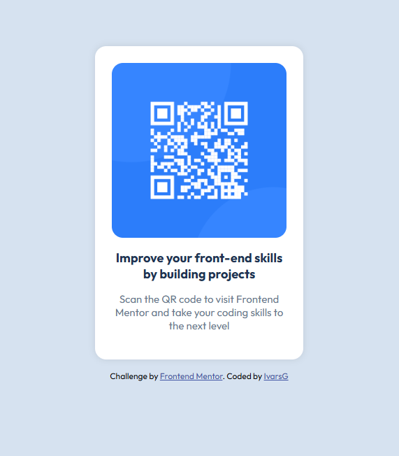

# Frontend Mentor - QR code component solution

This is a solution to the [QR code component challenge on Frontend Mentor](https://www.frontendmentor.io/challenges/qr-code-component-iux_sIO_H). Frontend Mentor challenges help you improve your coding skills by building realistic projects. 

## Table of contents

- [Overview](#overview)
  - [Screenshot](#screenshot)
  - [Links](#links)
- [My process](#my-process)
  - [Built with](#built-with)
  - [What I learned](#what-i-learned)
  - [Continued development](#continued-development)
- [Author](#author)

## Overview

### Screenshot



### Links

- Solution URL: [https://www.frontendmentor.io/solutions/qr-code-solution-using-flexbox-xp1DZ1nkQA](https://www.frontendmentor.io/solutions/qr-code-solution-using-flexbox-xp1DZ1nkQA)
- Live Site URL: [https://ivarsgetins.github.io/qr_code_component/](https://ivarsgetins.github.io/qr_code_component/)

## My process

### Built with

- Semantic HTML5 markup
- CSS custom properties
- Flexbox

### What I learned

It was my first experience working with Flexbox, although I still don't feel comfortable with it, it's a good start.

```css
 body {
        margin: 0;
        padding: 0;
        display: flex;
        flex-direction: column;
        justify-content: center;
        align-items: center;
        min-height: 100vh;
        font-family: "Outfit", sans-serif;
        background-color: hsl(212, 45%, 89%);
      }
```

### Continued development

- Using Flexbox
- I want to learn more about React/Angular and also use them in future challenges

## Author

- Frontend Mentor - [@IvarsGetins](https://www.frontendmentor.io/profile/IvarsGetins)

